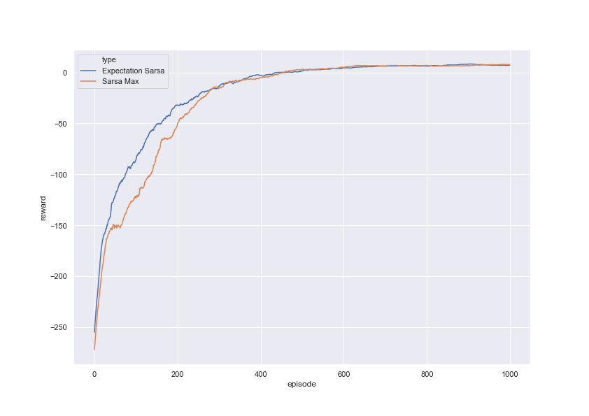
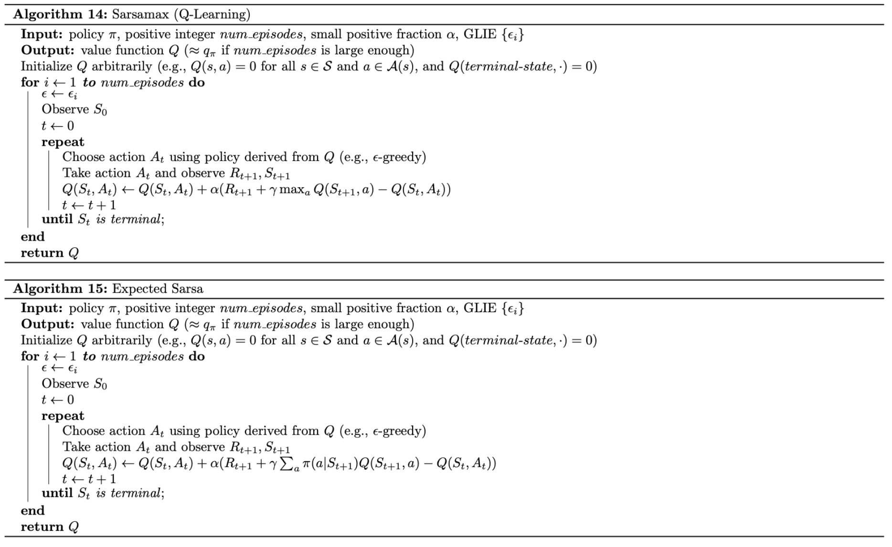

# Solution for OpenAI Gym Taxi problem v2 and v3 using temporal difference methods - SarsaMax and Expected Sarsa
This is a solution for Gym Taxi problem as discussed in the Reinforcement Learning cource at Udacity.

main.py and monitor.py are slightly modified versions for enviroment setup from the cource.

agent.py is my solution for the problem
hyper_opt.py is a script to find optimal set of hyperparameters for each algorithm.


## Attention - Taxt-V2 vs Taxi-V3

Recent version of Gym has deprecated Taxi-v2, which was mainly used to it's leaderboard. So, by default local requirements.txt install gym==0.14, that still has Taxi-V2.

Taxi-V3 is a more difficult version of the problem, to run it, please do manually

```bash
pip install gym==0.16
```

To run hyper parameters optimization you can use 

```bash
python hyper_opt.py --taxi_version v3
```

## Best score results
I've obtained following best runs (best out of 10):

| Env        | Sarsa Max     | Expecation Sarsa  |
| ---------- |:-------------:| -----:|
| Taxi-V2    | 9.49          | 9.44  |
| Taxi-V3    | 9.07          | 8.8   |


In Taxi-V2 version Sarsa Max outperformed Exp. Sarsa in 30% of cases (10 runs) - not enough for any conclusions.
In Taxi-V3 version Sarsa Max outperformed Exp. Sarsa in 60% of cases (10 runs) - not enough for any conclusions.

It would be nice if someone could run this until statistically meaningful difference p-value or t-criterion is found.

## Online performance

| Taxi-V2             |  Taxi-V3 |
:-------------------------:|:-------------------------:
  |  

Sarsa Max gets worse online performance but still converges to the same policy as Expected Sarsa.

## How to run 

#### To see online training
```bash
python main.py 
```

#### To tune hyperparameters
```bash
python hyper_opt.py --n_iters 5 --algo sarsamax --taxi_version v2
```

#### Verify results
Run in jupyter: run_analysis_taxiv2.ipynb and run_analysis_taxiv3.ipynb

## Notes
### Used pseudocode

 

### SarsaMax/ExpectedSarsa optimal hyperparameters

optimal_sarsa_max = {'algorithm': 'sarsamax','alpha': 0.2512238484351891, 'epsilon_cut': 0, 'epsilon_decay': 0.8888782926665223, 'start_epsilon': 0.9957089031634627, 'gamma': 0.7749915552696941}
optimal_exp_sarsa = {'algorithm': 'exp_sarsa', 'alpha': 0.2946281065178629, 'epsilon_cut': 0, 'epsilon_decay': 0.8978159313202051, 'start_epsilon': 0.9803552534195048, 'gamma': 0.6673937505783256}

